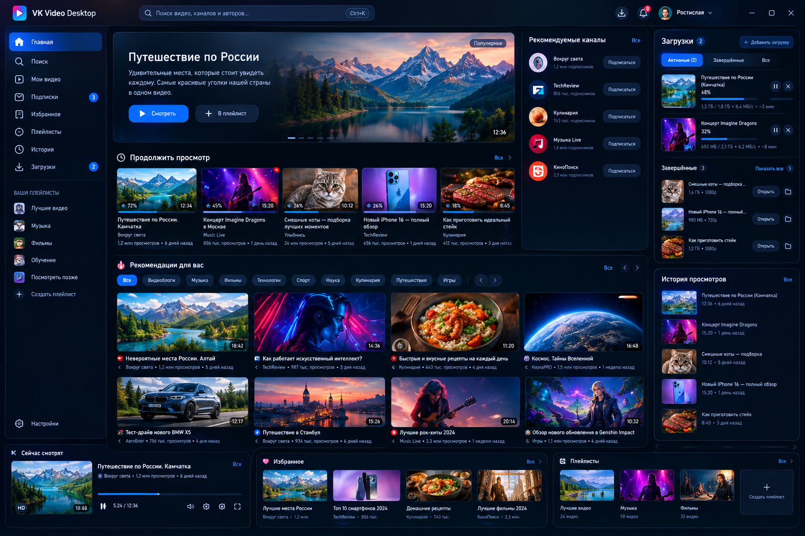

# VK Video Desktop

<div align="center">



**Нативный десктопный клиент VK Video для Windows с полноценным менеджером загрузок**

[](https://github.com/nvros86/vk-video-desktop/actions/workflows/ci.yml)
[](LICENSE)
[](https://dotnet.microsoft.com/download/dotnet/9.0)
[](https://learn.microsoft.com/windows/apps/winui/)

[Скачать](#установка) | [Функции](#возможности) | [Сборка](#сборка-и-разработка) | [Контрибьюция](#контрибьюция)

</div>

---

## Возможности

### Видео и воспроизведение
- Поиск видео по запросам, каналам и авторам
- Просмотр рекомендаций и популярных видео
- Страницы каналов с описанием и списком видео
- Категории: Видеоблоги, Музыка, Фильмы, Технологии, Спорт, Наука, Кулинария, Путешествия, Игры

### Плеер
- Воспроизведение с выбором качества (240p — 1080p)
- Кнопки: play/pause, перемотка ±5с/±10с, громкость, полноэкранный режим
- Скорость воспроизведения (0.25x — 2x)
- Mini Player — плавающее окно поверх всех окон
- Picture-in-Picture
- Автоматическое воспроизведение следующего видео
- Очередь воспроизведения

### Менеджер загрузок
- Скачивание видео в various качествах
- Прогресс, скорость, ETA
- Пауза / Продолжить / Отмена / Повтор
- Возобновление загрузки через HTTP Range
- Параллельная загрузка нескольких файлов
- Проверка свободного места на диске
- Ограничение скорости
- Атомарное завершение файла
- Восстановление после аварийного завершения
- Windows-уведомления о завершении загрузки

### Организация
- Избранное — сохранение понравившихся видео
- Плейлисты — создание и управление коллекциями
- История просмотров с возможностью продолжить просмотр
- Профиль пользователя

### Интерфейс
- Тёмная тема (по умолчанию)
- Русский и английский языки
- Системный трей — приложение сворачивается в трей
- Горячие клавиши:
  - `Space` / `K` — play/pause
  - `F` — полноэкранный режим
  - `M` — выключение звука
  - `←` / `→` — перемотка ±5с
  - `Shift+←` / `Shift+→` — перемотка ±10с
  - `↑` / `↓` — громкость ±5%
  - `Ctrl+K` — фокус на поиске
  - `Esc` — выйти из полноэкранного режима
- Deep links: `vkvideo://` протокол

---

## Технологии

| Компонент | Технология |
|-----------|-----------|
| Язык | C# 12 |
| Рантайм | .NET 9 |
| UI-фреймворк | WinUI 3 / Windows App SDK 1.7 |
| Архитектура | MVVM |
| База данных | SQLite |
| WebView | WebView2 |
| DI | Microsoft.Extensions.Hosting |
| Логирование | Serilog |
| Тестирование | xUnit + Moq |

---

## Структура проекта

```
VKVideoDesktop.sln
src/
├── VKVideoDesktop.App/            — WinUI 3 приложение (точка входа, DI, системный трей)
├── VKVideoDesktop.Core/           — Модели, перечисления, интерфейсы (без зависимостей)
├── VKVideoDesktop.Application/    — Бизнес-логика (сервисы)
├── VKVideoDesktop.Infrastructure/ — VK API, движок загрузок, кэш, WebView
├── VKVideoDesktop.Data/           — SQLite-хранилище
├── VKVideoDesktop.Tests/          — Юнит-тесты (xUnit)
└── VKVideoDesktop.Installer/      — Установщик (WPF)
```

**Поток зависимостей:** `App → Infrastructure, Application, Data → Core`

---

## Установка

### Из релиза

1. Скачайте последний релиз с [Releases](https://github.com/nvros86/vk-video-desktop/releases)
2. Запустите `VKVideoDesktop_Setup.exe`
3. Следуйте инструкциям мастера установки

### Сборка из исходников

**Требования:**
- Windows 10/11 64-bit
- [.NET 9 SDK](https://dotnet.microsoft.com/download/dotnet/9.0)

```bash
# Клонировать репозиторий
git clone https://github.com/nvros86/vk-video-desktop.git
cd vk-video-desktop

# Восстановить зависимости
dotnet restore VKVideoDesktop.sln

# Собрать
dotnet build VKVideoDesktop.sln -c Release

# Запустить тесты
dotnet test VKVideoDesktop.sln -c Release

# Опубликовать (самостоятельный exe)
dotnet publish src/VKVideoDesktop.App/VKVideoDesktop.App.csproj -c Release -r win-x64 --self-contained true -p:PublishSingleFile=false -o publish
```

Результат публикации: папка `publish/` с `VKVideoDesktop.App.exe`.

---

## Сборка и разработка

### Команды

| Команда | Описание |
|---------|----------|
| `dotnet restore VKVideoDesktop.sln` | Восстановление NuGet-пакетов |
| `dotnet build VKVideoDesktop.sln` | Сборка проекта (Debug) |
| `dotnet build VKVideoDesktop.sln -c Release` | Сборка в Release |
| `dotnet test VKVideoDesktop.sln` | Запуск всех тестов |
| `dotnet test --filter "FullyQualifiedName~DownloadTests"` | Запуск конкретного теста |

### Архитектура

**DI-контейнер** регистрируется в `App.xaml.cs`:
- Все сервисы — **Singleton**
- `SearchService`, `VideoService`, `DownloadService` — **Transient**

**Системный трей:** Реализован через Win32 P/Invoke (`Shell_NotifyIcon`), так как WinUI 3 не имеет встроенной поддержки системного трея.

**Движок загрузок:** Кастомная реализация с поддержкой:
- Стриминга данных
- Возобновления через HTTP Range
- Атомарного завершения файла
- Ограничения скорости
- Проверки свободного места

---

## Тестирование

Тесты расположены в `src/VKVideoDesktop.Tests/`:

| Категория | Описание |
|-----------|----------|
| `Unit/ModelTests.cs` | Тесты моделей данных |
| `Unit/ServiceTests.cs` | Тесты сервисов |
| `Unit/DownloadTests.cs` | Тесты движка загрузок |
| `Unit/DeepLinkTests.cs` | Тесты обработки deep links |

Запуск:
```bash
dotnet test VKVideoDesktop.sln -c Release --verbosity normal
```

---

## CI/CD

GitHub Actions автоматически:
1. Восстанавливает зависимости
2. Собирает проект в Release
3. Запускает тесты
4. Публикует standalone-сборку для win-x64
5. Загружает артефакт

См. `.github/workflows/ci.yml`.

---

## Контрибьюция

1. Fork репозитория
2. Создайте ветку для изменений (`git checkout -b feature/my-feature`)
3. Внесите изменения
4. Запустите тесты (`dotnet test`)
5. Коммитьте (`git commit -m 'Add my feature'`)
6. Отправьте (`git push origin feature/my-feature`)
7. Откройте Pull Request

### Код-стайл

- 4 пробела для `.cs` / `.xaml`, 2 пробела для `.csproj` / `.json`
- File-scoped namespaces (`namespace X;`)
- Nullable reference types включены
- Не добавляйте комментарии除非 explicitly requested

---

## Лицензия

Этот проект распространяется под лицензией [MIT](LICENSE).

---

## Благодарности

- [VK](https://vk.com/) за API
- [Microsoft](https://www.microsoft.com/) за WinUI 3 и .NET 9
- Сообществу open-source за инструменты и библиотеки
